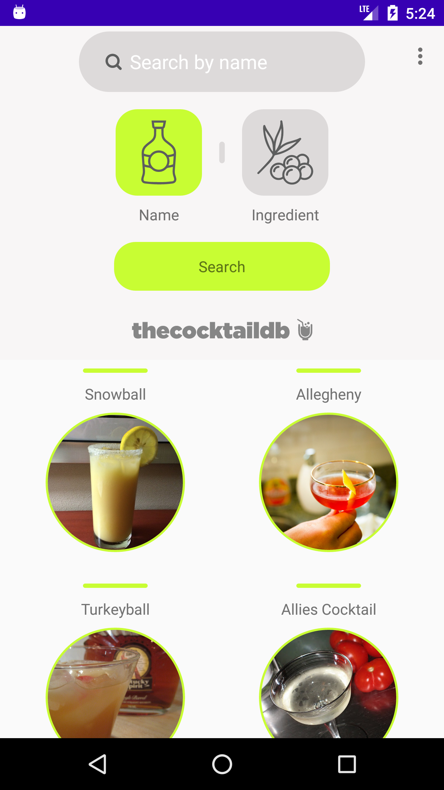
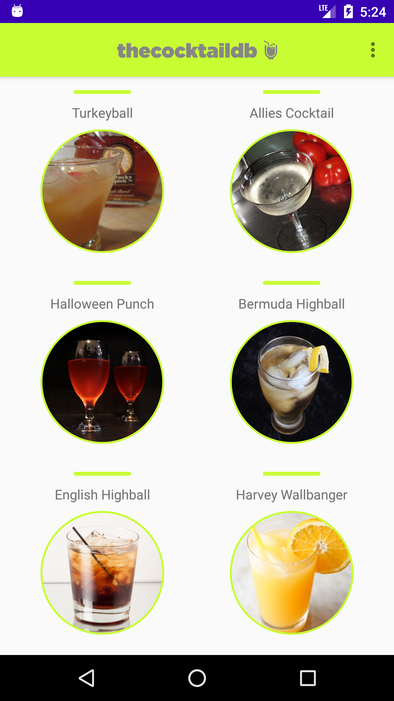

# DrinksDB
Android application using the thecocktaildb API

## About This Project
This repository contains an Android project using Kotlin, MVVM Architecture Components, LiveData , View Model, Retrofit2 for consuming rest api, Moshi, ROOM database, Glide images, Data Binding, SafeArgs, Navigation components, Material design, Recyclerview, Coroutines, Collapsing toolbar and smooth Animations.

## App Features
* Show list of drinks, search by name or ingredient and save it to favorites

## App demo 
 

## Library Used
* [Android Architecture Components](https://developer.android.com/topic/libraries/architecture/)
* [Live Data](https://developer.android.com/topic/libraries/architecture/livedata)
* [View Model](https://developer.android.com/topic/libraries/architecture/viewmodel)
* [Retrofit](https://square.github.io/retrofit/)
* [thecocktaildb API](https://www.thecocktaildb.com/api.php)
* [Glide](https://github.com/bumptech/glide)
* [Recyclerview](https://developer.android.com/guide/topics/ui/layout/recyclerview)

## Author

**Pablo Vydra** 
* [GitHub](https://github.com/pablovydra)
* [Linkedin](https://www.linkedin.com/in/pablovydra)
* [Twitter](https://twitter.com/pablovydra?lang=es)
* [Behance](https://www.behance.net/pablovydra)

## License

This project is licensed under the MIT License - see the [LICENSE.md](https://github.com/pablovydra/DrinksDB/master/LICENSE) file for details
